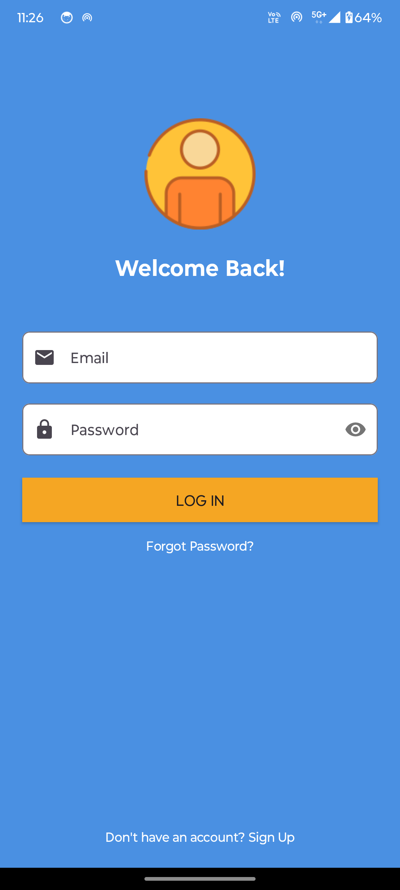
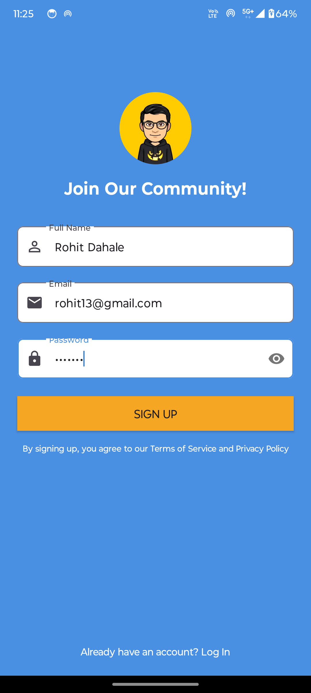
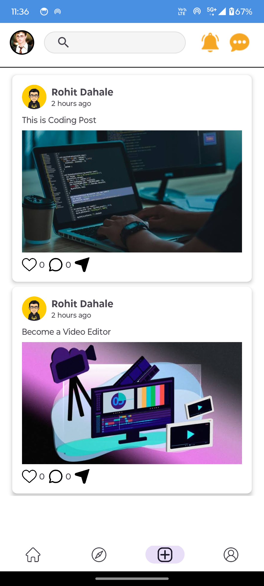
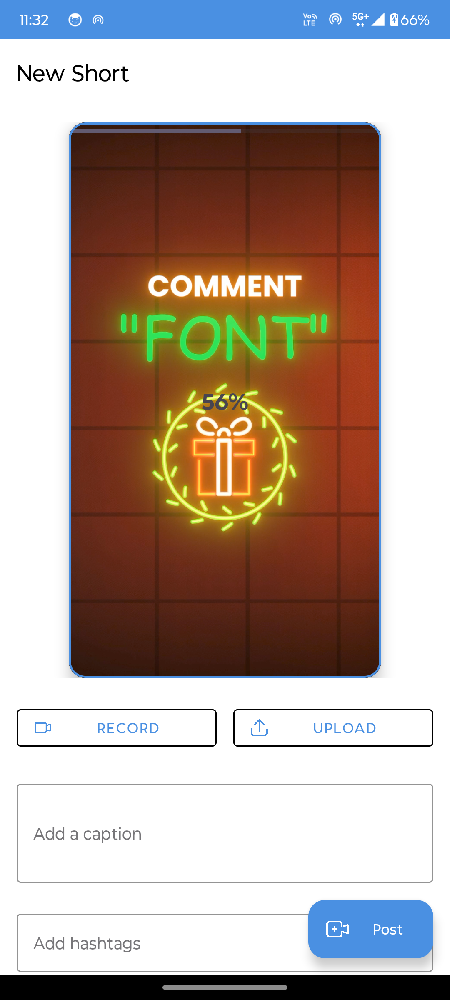
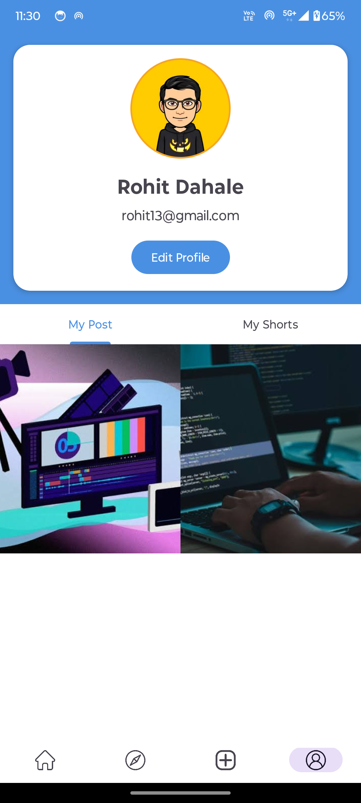
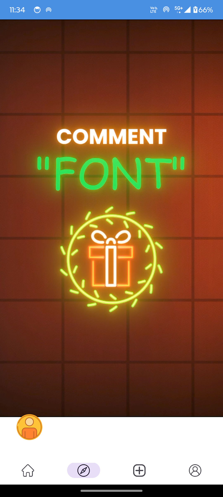

# 📱 SocialMediaApp

SocialMediaApp is a dynamic social media application where users can share posts, interact with stories, and engage with each other through short videos (shorts). The app uses Firebase Firestore for real-time database functionalities.

## 🚀 Features

- 🔐 **Login & Signup**: Secure user authentication
- 🏠 **Home Feed**: See posts from people you follow
- ✏️ **Create Post**: Share posts with images and text
- 👥 **Stories & Shorts**: Watch and interact with stories and short videos
- 🙍‍♂️ **Profile Page**: Manage your profile and posts

## 📸 Screenshots

### 1. 🔐 Login & Signup Page

| Login | Signup |
| ----- | ------ |
|  |  |

### 2. 🏠 Home Page

| Home Feed | Upload Short |
| --------- | -------- |
|  |  |

### 3. Profile 👥  & Shorts

| Profile | Shorts View |
| ------------ | ----------- |
|  |  |


## 🛠️ Technologies Used

- **Kotlin**: For building the Android app
- **Firebase Firestore**: For storing posts and user data
- **Firebase Authentication**: For user authentication
- **RecyclerView**: For displaying stories and posts
- **Glide/Picasso**: For loading images efficiently

## 📂 Folder Structure

```plaintext
├── adapters/               # RecyclerView Adapters for posts and stories
├── fragments/              # Home, Profile, and Shorts fragments
├── models/                 # Data models (Post, User, etc.)
├── utils/                  # Utility classes and constants (e.g., Firestore paths)
├── res/
│   ├── drawable/           # App icons and images
│   ├── layout/             # XML layout files for activities and fragments
│   └── values/             # Colors, strings, and styles
